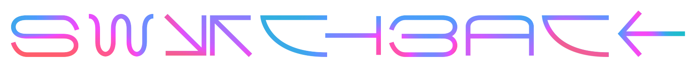
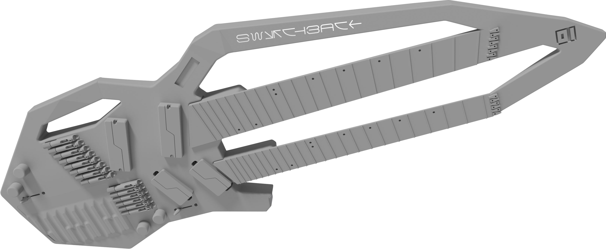
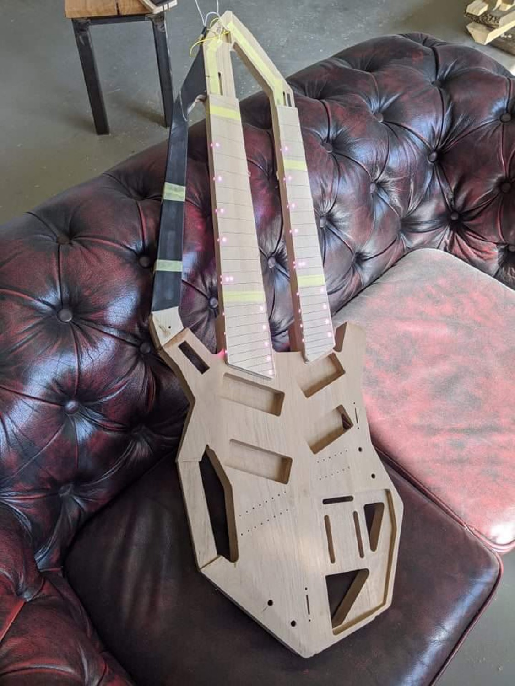
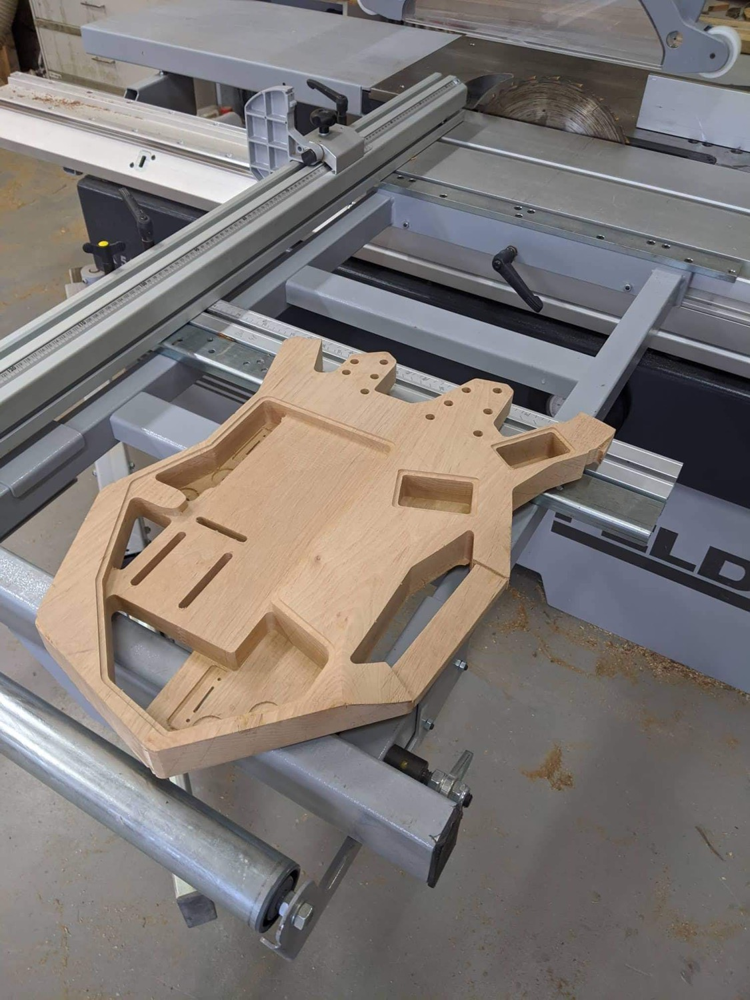

 

 

 

Custom double-neck guitar design with keyboard for playing [neurometal](https://www.youtube.com/playlist?list=PL2ZwTvIdYJGJxl1kszP3a_z6O4DcHwvok).

* 6-string (bottom) modeled after [Strandberg Boden Metal 6](https://strandbergguitars.com/product/boden-metal-6-white-pearl/) with Fishman Fluence Modern 6 pickups
* 8-string (top) modeled after [Strandberg Boden Metal 8](https://www.sweetwater.com/store/detail/BDMT8BKP--strandberg-boden-metal-8-black-pearl) with Fishman Fluence Modern 8 pickups
* 9-key [Roli Seaboard Block keyboard](https://roli.com/products/seaboard) (bottom) with two extra dimensions of touch
* Built-in oscilloscope can display a waveform from a remote synth or sampler, similar to [Korg Minilogue](https://www.sweetwater.com/store/detail/MinilogueXD--korg-minilogue-xd-4-voice-analog-synthesizer)

|Content|In|
|-|-|
|Autodesk Inventor, AutoCAD|./src|
|Concept art and inspiration|./design|
|CAD Drawings|./design/cad|
|3D Renders|./design/render|
|References based on|./references|
|Export to various formats|./export|

 

 

