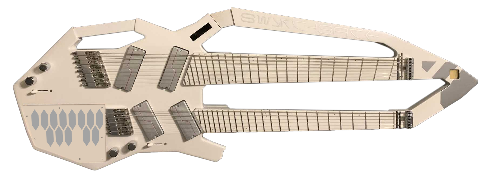
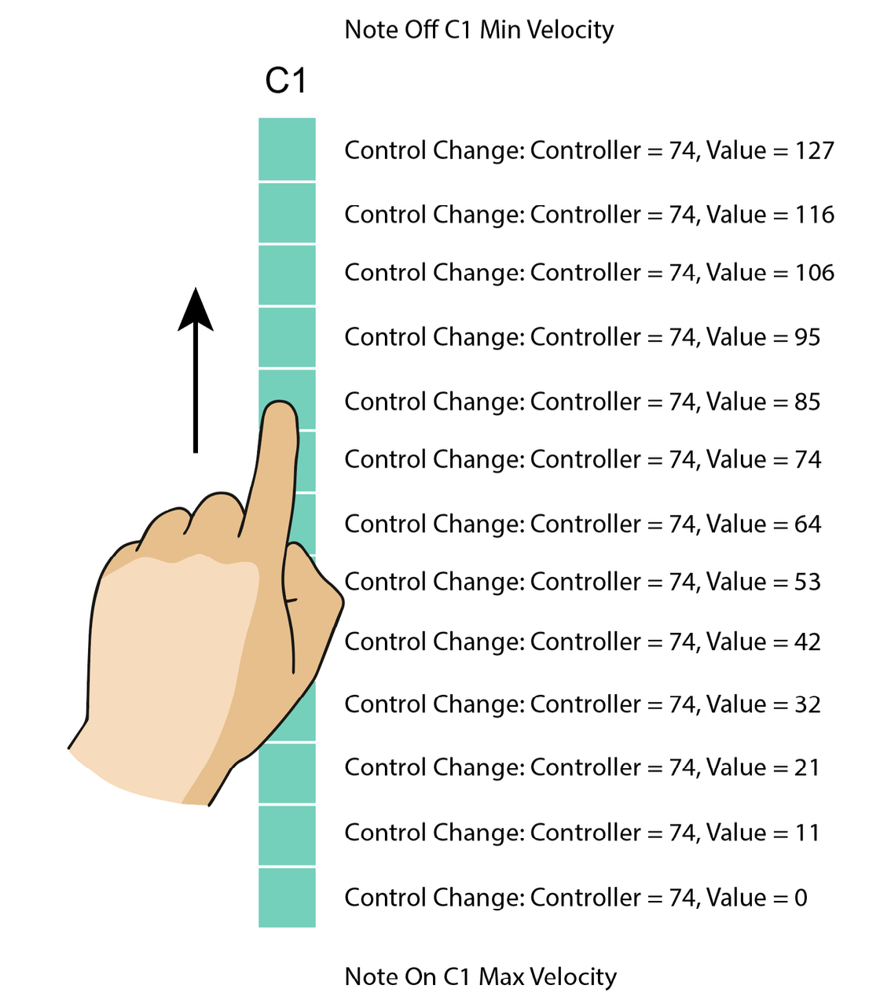

# Embedded MIDI Keyboard

A PCB embedded at the bottom of a custom guitar, with capacitive touch electrodes that function like keyboard keys. Touching keys sends MIDI messages over Bluetooth.

Each of the `13` keys is divided into `24` electrodes and functions like a capacitive touch slider, allowing the user to slide their finger up and down on each key to control MIDI "brightness" parameter (`CC74`).

## Overview

* All MIDI messages are sent on channel `1`
* Touching any electrode of a key will send a MIDI `Note On` message with maximum velocity and the note value set according to the key index
* When touch is no longer registered on a key, the controller will send a MIDI `Note Off` message with minimum velocity
* Only one note and one electrode can be active at a time (*monophonic* behavior). If several are registering touch, the software will try to find the geometric center of all the electrodes being touched and consider the electrode that intersects the center as the active one.
* Depending on which key electrode was touched (`0` through `23`), the controller will send a `Control Change` message with controller `74` (or `4AH`, mapped to *brightness* in MIDI specification) and value equal to the index of the key electrode mapped onto `0` through `127` range.

## Requirements

+ Given my finger is over `C1` key
+ When I touch any of the electrodes within this key
  - Then I get **MIDI Control Change** message on channel `1`
    * And Controller is `4AH` (`74` decimal) labeled "Brightness" in MIDI manual
    * And Control Value is between `0` and `127` depending the closest electrode to my fingerHp when the key is touched (see Mapping below)
  - Then I get **MIDI Note On** message on channel `1`
    * And Pitch is `C1`
    * And Velocity is always `127` (maximum velocity)
+ When I touch any of the electrodes within `C2` key while still holding down `C1` key
  - Then I get **MIDI Control Change** message on channel `1`
    * And Controller is `4AH` (`74` decimal) labeled "Brightness" in MIDI manual
    * And Control Value is between `0` and `127` depending the closest electrode
to my fingerHp when the key is touched (see Mapping below) o ThenIgetMIDINoteOffmessageonChannel1
    * And Pitch is `C1`
    * And Velocity is always `0` (minimum velocity)
  - Then I get **MIDI Note On** message on channel `1`
    * And Pitch is `C2`
    * And Velocity is always `127` (maximum velocity)
+ When I release the key
  - Then I get MIDI Control Change message on channel `1`
    * And Controller is `4AH` (`74` decimal) labeled "Brightness" in MIDI manual
    * And Control Value is between `0` and `127` depending the closest electrode
to my fingerHp when the key is touched (see Mapping below)
  - Then I get **MIDI Note Off** message on channel `1`
    * And Pitch is `C2`
    * And Velocity is always `0` (minimum velocity)

## Testing

[MIDI Monitor](https://www.snoize.com/MIDIMonitor/) can be used for testing this device once assembled to ensure it adheres to above requirements.

## Architecture

### Controller

The [ESP32-S3-DEVKITC-1-N8](https://www.digikey.com/en/products/detail/espressif-systems/ESP32-S3-DEVKITC-1-N8/15199021) controller was chosen because it can function like a Bluetooth MIDI device, and it's also used for the embedded oscilloscope board in the same project.

### Capacitive Touch

The [MPR121QR2](https://www.digikey.com/en/products/detail/nxp-usa-inc/MPR121QR2/2186527) capacitive touch controller was selected due to its simplicity, reliability, and native I²C interface. Each MPR121 provides **12 capacitive electrodes**, and multiple devices can coexist on the same I²C bus using its **four selectable I²C addresses (0x5A–0x5D)**.

This project requires **13 keys × 24 electrodes per key = 312 total electrodes**, corresponding to **26 MPR121 devices** (2 per key).

To minimize device count, routing complexity, and I²C bus capacitance, the design shall use a **single [TCA9548A](https://www.digikey.com/en/products/detail/texas-instruments/tca9548apwr/3615458) I²C multiplexer**. Each TCA9548A downstream channel may host **up to four MPR121 devices**, differentiated by their I²C addresses. With this approach, all 26 MPR121 devices can be supported using **7 of the 8 available TCA9548A channels**, leaving one channel unused for expansion or debugging.

This architecture is preferred over a "one-sensor-per-mux-channel" approach because it:

- Minimizes the number of multiplexers
- Reduces PCB routing congestion
- Keeps I²C timing deterministic
- Simplifies firmware scanning (each sensor is read once per scan cycle)

Each key shall be treated logically as a **1D capacitive slider**, composed of **24 contiguous electrodes**, with position derived in firmware from the combined electrode state.

### Power

The power circuitry is identical to the embedded oscilloscope board which is also a part of this project.

A [USB-C](https://www.digikey.com/en/products/detail/hirose-electric-co-ltd/CX90B1-24P/8769505) receptacle is used to program the board, providing power during the programming process. Two [TS-1064S-A1B2-D4](https://www.lcsc.com/product-detail/C498294.html?s_z=n_C498294) switches (boot and reset) are also used for manual programming. A [DMN3135LVT-7](https://www.digikey.com/en/products/detail/diodes-incorporated/dmn3135lvt-7/2890874) MOSTFET assists with automatic programming from Arduino IDE, by "pressing" boot and reset buttons automatically at the right time.

The circuitry from [Adafruit LiPo backpack](https://www.adafruit.com/product/2124) is integrated directly onto the board to provide power from a LiPo battery after the device is programmed. This includes [S2B-PH-SM4-TB](https://www.digikey.com/en/products/detail/jst-sales-america-inc/s2b-ph-sm4-tb/926655) **battery connector** and a **sliding power switch**. If the battery is connected while power is provided to the USB-C connector, this also charges the battery.

The power switch is **external** for this project - but [S2B-PH-SM4-TB](https://www.digikey.com/en/products/detail/jst-sales-america-inc/s2b-ph-sm4-tb/926655) connector will be needed on the board to connect this external switch in a modular fashion. This is exactly the same connector as the one used for the battery.

The circuitry from [Adafruit LM3671 Buck Converter](https://www.adafruit.com/product/2745) is integrated directly onto the board to convert the battery voltage to `3.3V` that feeds Teensy and all other components.

## Components

|Component|Description|
|-|-|
|[ESP32-S3-DEVKITC-1-N8](https://www.digikey.com/en/products/detail/espressif-systems/ESP32-S3-DEVKITC-1-N8/15199021)|Controller
|[MCP73831T-2ACI/OT](https://www.digikey.com/en/products/detail/microchip-technology/mcp73831t-2aci-ot/964301)|Battery Charger
|[150080SS75000](https://www.digikey.com/en/products/detail/w-rth-elektronik/150080SS75000/4489919)|Red LED
|[150080GS75000](https://www.digikey.com/en/products/detail/w-rth-elektronik/150080GS75000/4489913)|Green LED
|[RE0805FRE071KL](https://www.digikey.com.au/en/products/detail/yageo/RE0805FRE071KL/5923534)|1K Resistor
|[RC0805FR-072K49L](https://www.digikey.com/en/products/detail/yageo/RC0805FR-072K49L/727695)|2.5K Resistor
|[RC0402FR-075K1L](https://www.digikey.com/en/products/detail/yageo/rc0402fr-075k1l/726624)|5.1K Resistor
|[AF0805FR-0710KL](https://www.digikey.it/en/products/detail/yageo/AF0805FR-0710KL/5901208)|10K Resistor
||75K Resistor
|[RC0805FR-07100KL](https://www.digikey.com/en/products/detail/yageo/RC0805FR-07100KL/727544)|100K Resistor
|[RTT01513JTH](https://www.lcsc.com/product-detail/C102736.html?s_z=n_C102736)|51K Resistor
|[S2B-PH-SM4-TB](https://www.digikey.com/en/products/detail/jst-sales-america-inc/S2B-PH-SM4-TB/926655)|LiPo Battery Connector, Power Switch Connector
|[CC0805KKX5R5BB106](https://www.digikey.com/en/products/detail/yageo/cc0805kkx5r5bb106/2833624)|10uF Capacitor
|[CC0805MKX5R5BB226](https://www.digikey.com/en/products/detail/yageo/CC0805MKX5R5BB226/2833629)|22uF Capacitor
|[CL03A104KP3NNNC](https://www.digikey.com/en/products/detail/samsung-electro-mechanics/cl03a104kp3nnnc/3886773)|100nF Capacitor
|[LM3671MFX-3.3/NOPB](https://www.digikey.com/en/products/detail/texas-instruments/LM3671MFX-3.3-NOPB/6597333)|3.3V DC-DC Buck Converter
|[NRH2412T2R2MNGH](https://www.digikey.com/en/products/detail/taiyo-yuden/NRH2412T2R2MNGH/4157831)|2.2uH Inductor
|[TS-1064S-A1B2-D4](https://www.lcsc.com/product-detail/C498294.html?s_z=n_C498294)|Boot and Reset Switches
|[TYPE-C-31-M-12](https://www.lcsc.com/product-detail/C165948.html)|USB-C Receptacle
|[DMN3135LVT-7](https://www.digikey.com/en/products/detail/diodes-incorporated/dmn3135lvt-7/2890874)|ESP32 Auto-program MOSFET
|[CH340C](https://www.lcsc.com/product-detail/C84681.html)|USB to Serial Converter
|[MPR121QR2](https://www.digikey.com/en/products/detail/nxp-usa-inc/mpr121qr2/2186527)|Capacitive Touch Sensor
|[TCA9548APWR](https://www.digikey.com/en/products/detail/texas-instruments/tca9548apwr/3615458)|I2C Multiplexer (Bus Switch)
