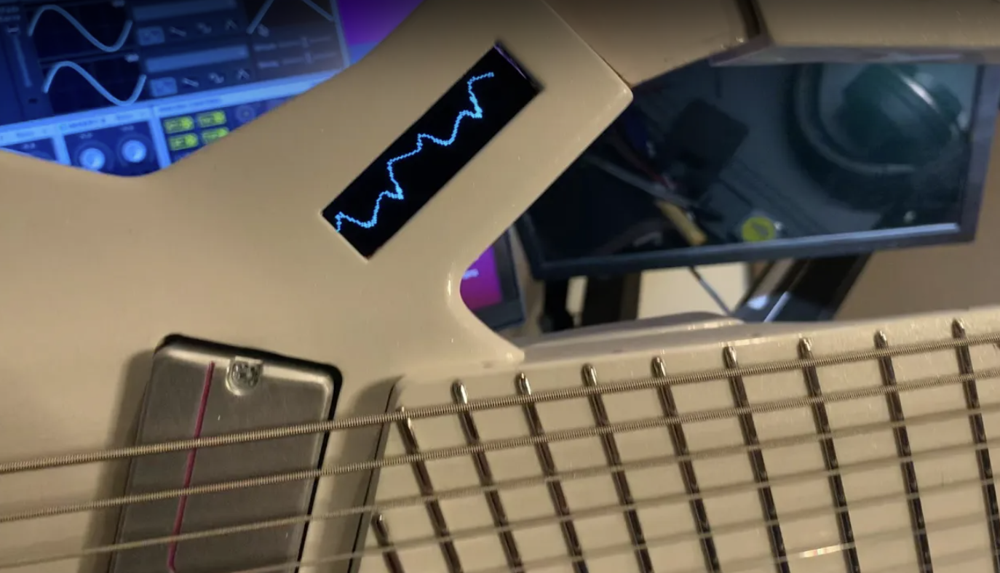
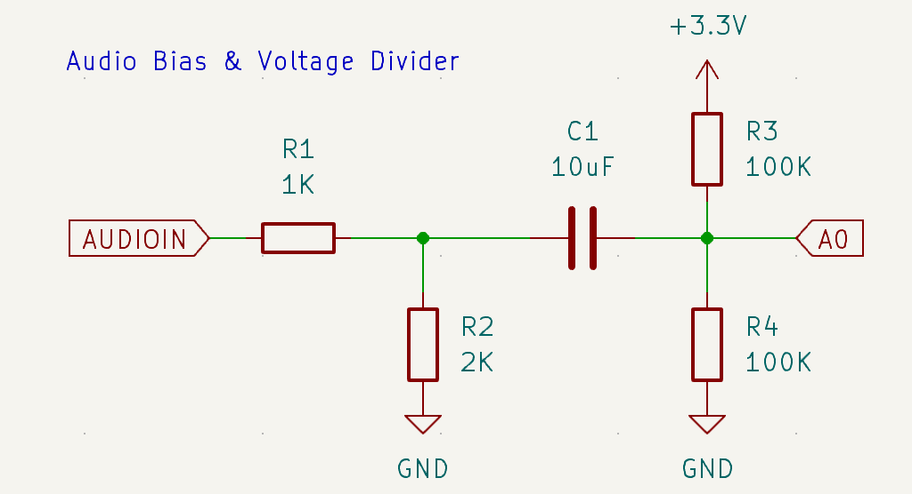

# Embedded Oscilloscope

A PCB used to [display the waveform](https://www.youtube.com/watch?v=wj2-lyEgEZo&t=18s) of an audio signal received from a Bluetooth Audio board on a small OLED screen built into a guitar handle.

This oscilloscope uses [Arduino Nano 33 BLE](https://store-usa.arduino.cc/products/arduino-nano-33-ble-with-headers) as a controller, powered by a LIPO battery by using an Adafruit [LIPO battery breakout](https://www.adafruit.com/product/1578) through an Adafruit [buck converter breakout](https://www.adafruit.com/product/2745).

The Audio source is a [Bluetooth Audio board](https://www.amazon.com/dp/B07W7YCFS1) that advertizes itself as an audio source to nearby devices.

When a client connects and sends audio data, the signal from Bluetooth Audio `L` pin (Left Channel) goes through a small circuit that biases the input voltage and reduces the range from `5V` to `3.3V`:

## Architecture

The embedded oscilloscope consists of the following components:

|Component|Purpose|
|---------|-------|
|[Monochrome 128x32 OLED Graphic Display Module](https://www.adafruit.com/product/2675)|Displays the waveform
|[Arduino Nano 33 BLE](https://store-usa.arduino.cc/products/arduino-nano-33-ble-with-headers)|Receives audio signal and draws the audio waveform on the screen|
|[LiPo Battery Backpack](https://www.adafruit.com/product/2124)|Provides `5V` power from the battery to the buck converter and also charges the battery from USB when controller is connected to USB|
|[LiPo Battery](https://www.adafruit.com/product/1578)|Provides power to the embedded device|
|[LM3671 Buck Converter](https://www.adafruit.com/product/2745)|Converts `5V` power from Lipo Backpack to `3.3V` for the controller
|[M28 Wireless Bluetooth Audio Receiver](https://www.amazon.com/dp/B07W7YCFS1)|Advertizes BT Audio device, sends audio to ItsyBitsy ADC pin when audio data is received from connected client.
|[DPDT Switch](https://www.amazon.com/dp/B008DFYHV2)|Power switch|

## Code

The oscilloscope code is in `/src` folder, see [oscilloscope.ino](./src/oscilloscope.ino).

When there is no audio coming from the Bluetooth board (or the level is considered too low), the product logo is displayed instead.

The logo is encoded as a byte array in [splash.h](./src/splash.h), which is included in the oscilloscope code upload.

## Issues

The current design results in a "sandwich" made of several components hot-glued together, with manual soldering necessary to connect the components:

* OLED Screen
* Bluetooth Board
* LiPo backpack
* Routing Board (contains the voltage bias/divider circuit and routes connections between all other components)
* Lipo Battery
* Switch

The width & height of the device are defined by the size of the OLED module, but the depth is defined by the height of each board and its components.

There are two issues with this design that need to be solved:

* The overall depth of the device is too large to fit into the guitar. While the OLED screen, routing board, and ItsyBitsy are low profile, the Bluetooth Audio Board and Lipo Backpack are "tall".
* The wires from the switch to Lipo Backpack keep breaking and need to be re-soldered all the time.
* The wires from the SPI screen to the routing board sometimes get de-soldered as well.

I tried a lower-profile Bluetooth Audio board from the same manufacturer - [M18](https://www.amazon.com/dp/B07W4PJ469) - because it doesn't have the unnecessary huge capacitors and an external audio jack, but for some reason this board could not be made to work the same way as the [M28](https://www.amazon.com/dp/B07W7YCFS1).

It failed to advertise an audio device on many attempts, and during one of the attempts it did expose the audio device, but then did not send the audio signal through the Left audio pin.

## Design Goals

The physical footrint of the embedded oscilloscope should be reduced in *depth* (keeping width and length the same) and the overall module should be made more reliable.

Look into the following:
* Can another reliable Bluetooth Audio board be found that doesn't have large components like capacitors and an audio jack?
* Perhaps M18 does work, but I used it incorrectly (the audio output is not the same as M28 because it's amplified, or conversely, not amplified?)
* Can the LiPo Backpack components be directly integrated onto the oscilloscope board, allowing us to stop depending on this module which increases the overall footprint?
* Can the buck converter components be directly integrated onto the oscilloscope board?
* Can the switch be placed directly onto the oscilloscope board as an SMD component, so we can eliminate the unreliable external switch?
* Can we integrate Arduino Nano directly onto the oscilloscope board so that no wires are required?
* Can we choose another board like ESP32 S3 DevKit that can be baked directly onto the oscilloscope board by PCB manufacturer?
* What if we choose a controller that has built-in Bluetooth connectivity and can act as a Bluetooth Audio board itself, so we don't need an external board?

## Deliverables

* Improved architecture design document: suggesting changes to the original architecture that addresses all the issues
* KiCad 9 Schematic and Board files
* JLCPCB manufacturing output generated by using [JLCPCB KiCad plugin](https://github.com/Bouni/kicad-jlcpcb-tools)