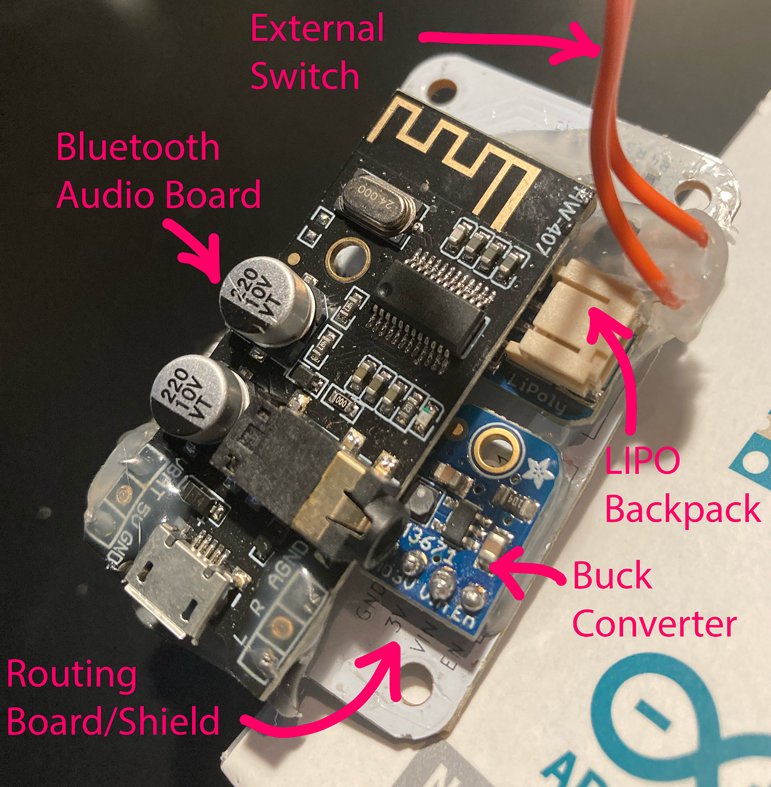

# Embedded Oscilloscope

A PCB used to [display the waveform](https://www.youtube.com/watch?v=wj2-lyEgEZo&t=18s) of an audio signal received from a Bluetooth Audio board on a small OLED screen built into a guitar handle.

This oscilloscope uses [Arduino Nano 33 BLE](https://store-usa.arduino.cc/products/arduino-nano-33-ble-with-headers) as a controller, powered by a LIPO battery by using an Adafruit [LIPO battery breakout](https://www.adafruit.com/product/1578) through an Adafruit [buck converter breakout](https://www.adafruit.com/product/2745).

The Audio source is a [Bluetooth Audio board](https://www.amazon.com/dp/B07W7YCFS1) that advertizes itself as an audio source to nearby devices.

When a client connects and sends audio data, the signal from Bluetooth Audio goes through a bias and voltage divider circuit to make it possible to route it to the controller's ADC.

## Architecture

The embedded oscilloscope consists of the following components:

|Component|Purpose|
|---------|-------|
|[Monochrome 128x32 OLED Graphic Display Module](https://www.adafruit.com/product/2675)|Displays the waveform
|[Arduino Nano 33 BLE](https://store-usa.arduino.cc/products/arduino-nano-33-ble-with-headers)|Receives audio signal and draws the audio waveform on the screen|
|[LiPo Battery Backpack](https://www.adafruit.com/product/2124)|Provides `5V` power from the battery to the buck converter and also charges the battery from USB when controller is connected to USB|
|[LiPo Battery](https://www.adafruit.com/product/1578)|Provides power to the embedded device|
|[LM3671 Buck Converter](https://www.adafruit.com/product/2745)|Converts `5V` power from Lipo Backpack to `3.3V` for the controller
|[M28 Wireless Bluetooth Audio Receiver](https://www.amazon.com/dp/B07W7YCFS1)|Advertizes BT Audio device, sends audio to Arduino ADC pin when audio data is received from connected client.
|[DPDT Switch](https://www.amazon.com/dp/B008DFYHV2)|Power switch|

## Code

The oscilloscope code is in `/src` folder, see [oscilloscope.ino](./src/oscilloscope.ino).

When there is no audio coming from the Bluetooth board (or the level is considered too low), the product logo is displayed instead.

The logo is encoded as a byte array in [splash.h](./src/splash.h), which is included in the oscilloscope code upload.

## Issues

The current design results in a "sandwich" made of several components hot-glued together, with manual soldering necessary to connect the components:

|  |  |
|--|--|
||

The length & width of the device are defined by the size of the OLED module, but the depth is defined by the height of each board and its components.

The following issues with this design need to be solved:

* The overall depth of the device is too large to fit into the guitar. While the OLED screen, routing board, and the controller are relatively low profile, the Bluetooth Audio Board, Lipo Backpack, and Buck Converter are too tall.
* The wires from the switch to Lipo Backpack keep breaking and need to be re-soldered all the time.
* The wires from the SPI screen to the routing board sometimes get de-soldered as well.

I tried a lower-profile Bluetooth Audio board from the same manufacturer - [M18](https://www.amazon.com/dp/B07W4PJ469) - because it doesn't have the large capacitors and an external audio jack, but for some reason this board could not be made to work the same way as the [M28](https://www.amazon.com/dp/B07W7YCFS1).

It failed to advertise an audio device on many attempts, and during one of the attempts it did expose the audio device, but then did not send the audio signal through the Left audio pin.

## Re-design Goals

The physical footrint of the embedded oscilloscope should be reduced in *depth* (keeping width and length the same) and the overall module should be made more reliable:

* Eliminate dependence on an external Bluetooth Audio board by switching to `ESP32-WROOM`, for example [ESP32-WROOM-32E](https://www.digikey.com/en/products/detail/espressif-systems/esp32-wroom-32e-m113eh3200ph3q0/17887553) controller which supports the `A2DP` protocol [needed to advertise a Bluetooth Audio source](https://github.com/pschatzmann/ESP32-A2DP/wiki/Support-for-esp32-c3%3F).
* Shrink the controller used by switching from Arduino Nano 33 BLE to ESL32-WROOM, integrating the controller directly onto the board as an SMD component
* Integrate [LiPo Backpack](https://www.adafruit.com/product/2124) components directly onto the board instead of using this Adafruit breakout board as a module.
* Integrate [LM3671 Buck Converter](https://www.adafruit.com/product/2745) components directly onto the board instead of using this Adafruit breakout board as a module.
* Integrate the power switch directly onto the board to eliminate the need for soldering wires to an external switch, which keep breaking and de-soldering. Perhaps the switch can be on the other side of the board if there is no room on the front.
* The voltage divider/bias circuit will no longer be needed, since we will be getting audio information directly from Bluetooth already in digital form.
* Keep using the same monochrome OLED display: it needs to be connected to the SPI bus, +3.3V power, and GND.
* The board must not be larger than the OLED screen: 64.5mm x 33mm.

## Deliverables

* KiCad 9 Schematic and Board files
* JLCPCB manufacturing output generated by using [JLCPCB KiCad plugin](https://github.com/Bouni/kicad-jlcpcb-tools)

## New Architecture

The new board includes connections for plugging in the OLED screen and a LiPo battery, all other components are integrated directly onto the board.

|Component|Purpose|
|---------|-------|
|[Monochrome 128x32 OLED Graphic Display Module](https://www.adafruit.com/product/2675)|Display
|[ESP32-WROOM-32E](https://www.digikey.com/en/products/detail/espressif-systems/esp32-wroom-32e-m113eh3200ph3q0/17887553)|Controller|
|[LiPo Battery](https://www.adafruit.com/product/1578)|Provides power to the embedded device|
|[Switch](https://www.digikey.com/en/products/detail/c-k/js202011scqn/2094299)|Power switch|

## Bill of Materials

|Component|Description|
|---------|-----------|
|[ESP32-WROOM-32E](https://www.digikey.com/en/products/detail/espressif-systems/esp32-wroom-32e-m113eh3200ph3q0/17887553)|Controller|
|[MCP73831T-2ACI/OT](https://www.digikey.com/en/products/detail/microchip-technology/mcp73831t-2aci-ot/964301)|LiPo Charger IC
|[JS202011SCQN](https://www.digikey.com/en/products/detail/c-k/js202011scqn/2094299)|Power Switch
|[150080SS75000](https://www.digikey.com/en/products/detail/w-rth-elektronik/150080SS75000/4489919)|Red LED
|[150080GS75000](https://www.digikey.com/en/products/detail/w-rth-elektronik/150080GS75000/4489913)|Green LED
|[RE0805FRE071KL](https://www.digikey.com.au/en/products/detail/yageo/RE0805FRE071KL/5923534)|1K Resistor
|[RC0805FR-072K49L](https://www.digikey.com/en/products/detail/yageo/RC0805FR-072K49L/727695)|2.5K Resistor
|[AF0805FR-0710KL](https://www.digikey.it/en/products/detail/yageo/AF0805FR-0710KL/5901208)|10K Resistor
|[RC0805FR-07100KL](https://www.digikey.com/en/products/detail/yageo/RC0805FR-07100KL/727544)|100K Resistor
|[S2B-PH-SM4-TB](https://www.digikey.com/en/products/detail/jst-sales-america-inc/S2B-PH-SM4-TB/926655)|LiPo Battery Connector
|[CC0805KKX5R5BB106](https://www.digikey.com/en/products/detail/yageo/cc0805kkx5r5bb106/2833624)|10uF Capacitor
|[CC0805MKX5R5BB226](https://www.digikey.com/en/products/detail/yageo/CC0805MKX5R5BB226/2833629)|22uF Capacitor
|[LM3671MFX-3.3/NOPB](https://www.digikey.com/en/products/detail/texas-instruments/LM3671MFX-3.3-NOPB/6597333)|3.3V DC-DC Buck Converter
|[NRH2412T2R2MNGH](https://www.digikey.com/en/products/detail/taiyo-yuden/NRH2412T2R2MNGH/4157831)|2.2uH Inductor
