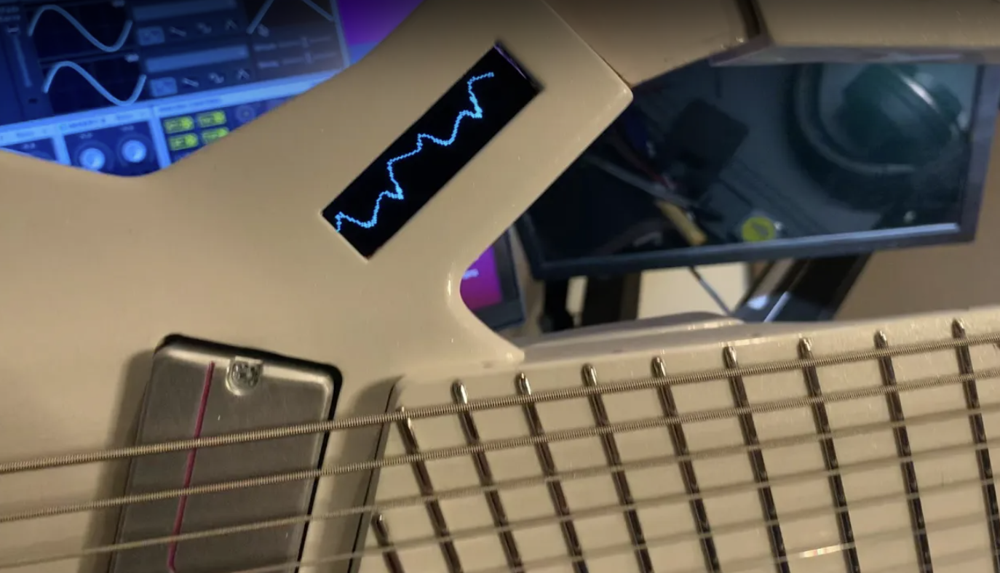

# Embedded Oscilloscope

A PCB used to [display the waveform](https://www.youtube.com/watch?v=wj2-lyEgEZo&t=18s) of an audio signal received from Bluetooth Audio on a small OLED screen built into a guitar handle.

The oscilloscope board uses connections for plugging in the OLED screen and a LiPo battery, all other components are integrated directly onto the board.

|Component|Purpose|
|---------|-------|
|[Monochrome 128x32 OLED Graphic Display Module](https://www.adafruit.com/product/2675)|Display
|[ESP32-WROOM-32E](https://www.digikey.com/en/products/detail/espressif-systems/esp32-wroom-32e-m113eh3200ph3q0/17887553)|Controller|
|[LiPo Battery](https://www.adafruit.com/product/1578)|Provides power to the embedded device|
|[Switch](https://www.digikey.com/en/products/detail/c-k/js202011scqn/2094299)|Power switch|

## Bill of Materials

|Component|Description|
|---------|-----------|
|[ESP32-WROOM-32E](https://www.digikey.com/en/products/detail/espressif-systems/esp32-wroom-32e-m113eh3200ph3q0/17887553)|Controller|
|[MCP73831T-2ACI/OT](https://www.digikey.com/en/products/detail/microchip-technology/mcp73831t-2aci-ot/964301)|LiPo Charger IC
|[JS202011SCQN](https://www.digikey.com/en/products/detail/c-k/js202011scqn/2094299)|Power Switch
|[150080SS75000](https://www.digikey.com/en/products/detail/w-rth-elektronik/150080SS75000/4489919)|Red LED
|[150080GS75000](https://www.digikey.com/en/products/detail/w-rth-elektronik/150080GS75000/4489913)|Green LED
|[RE0805FRE071KL](https://www.digikey.com.au/en/products/detail/yageo/RE0805FRE071KL/5923534)|1K Resistor
|[RC0805FR-072K49L](https://www.digikey.com/en/products/detail/yageo/RC0805FR-072K49L/727695)|2.5K Resistor
|[AF0805FR-0710KL](https://www.digikey.it/en/products/detail/yageo/AF0805FR-0710KL/5901208)|10K Resistor
|[RC0805FR-07100KL](https://www.digikey.com/en/products/detail/yageo/RC0805FR-07100KL/727544)|100K Resistor
|[S2B-PH-SM4-TB](https://www.digikey.com/en/products/detail/jst-sales-america-inc/S2B-PH-SM4-TB/926655)|LiPo Battery Connector
|[CC0805KKX5R5BB106](https://www.digikey.com/en/products/detail/yageo/cc0805kkx5r5bb106/2833624)|10uF Capacitor
|[CC0805MKX5R5BB226](https://www.digikey.com/en/products/detail/yageo/CC0805MKX5R5BB226/2833629)|22uF Capacitor
|[LM3671MFX-3.3/NOPB](https://www.digikey.com/en/products/detail/texas-instruments/LM3671MFX-3.3-NOPB/6597333)|3.3V DC-DC Buck Converter
|[NRH2412T2R2MNGH](https://www.digikey.com/en/products/detail/taiyo-yuden/NRH2412T2R2MNGH/4157831)|2.2uH Inductor
